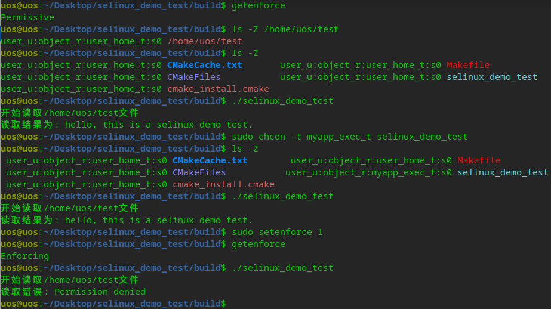

# 说明

This is a demo for selinux. 具体操作步骤请参考 社区版开启SELinux方法.txt

# 使用方式

selinux 文件夹是自定义的selinux策略文件，.pp是使用执行make之后生成的策略模块，加载策略模块的命令如下：

semodule是用于管理SELinux策略模块的工具，包括安装，升级，列出和删除模块。 semodule还可用于强制从模块存储重建策略和/或强制重新加载策略而不执行任何其他事务。 semodule作用于semodule_package创建的模块包。通常，这些文件具有.pp后缀（策略包），尽管这不是以任何方式强制执行的。

安装策略模块

```
sudo semodule -i selinux_demo_test.pp.bz2
```

卸载策略模块

```
sudo semodule -r selinux_demo_test.pp.bz2
```

cd build

cmake ..

make -j4

# 运行



```
uos@uos:/Desktop/selinux_demo_test/build$ getenforce
Permissive
uos@uos:/Desktop/selinux_demo_test/build$ ls -Z /home/uos/test
user_u:object_r:user_home_t:s0 /home/uos/test
uos@uos:/Desktop/selinux_demo_test/build$ ls -Z
user_u:object_r:user_home_t:s0 CMakeCache.txt       user_u:object_r:user_home_t:s0 Makefile
user_u:object_r:user_home_t:s0 CMakeFiles           user_u:object_r:user_home_t:s0 selinux_demo_test
user_u:object_r:user_home_t:s0 cmake_install.cmake
uos@uos:/Desktop/selinux_demo_test/build$ ./selinux_demo_test
开始读取/home/uos/test文件
读取结果为: hello, this is a selinux demo test.
uos@uos:/Desktop/selinux_demo_test/build$ sudo chcon -t myapp_exec_t selinux_demo_test
uos@uos:/Desktop/selinux_demo_test/build$ ls -Z
 user_u:object_r:user_home_t:s0 CMakeCache.txt        user_u:object_r:user_home_t:s0 Makefile
 user_u:object_r:user_home_t:s0 CMakeFiles           user_u:object_r:myapp_exec_t:s0 selinux_demo_test
 user_u:object_r:user_home_t:s0 cmake_install.cmake
uos@uos:/Desktop/selinux_demo_test/build$ ./selinux_demo_test
开始读取/home/uos/test文件
读取结果为: hello, this is a selinux demo test.
uos@uos:/Desktop/selinux_demo_test/build$ sudo setenforce 1
uos@uos:/Desktop/selinux_demo_test/build$ getenforce
Enforcing
uos@uos:/Desktop/selinux_demo_test/build$ ./selinux_demo_test
开始读取/home/uos/test文件
读取错误: Permission denied
```

# 清理

make clean

# 参考文档

* [安全性-SELinux介绍及测试](https://wikidev.uniontech.com/%E5%AE%89%E5%85%A8%E6%80%A7-SELinux%E4%BB%8B%E7%BB%8D%E5%8F%8A%E6%B5%8B%E8%AF%95)

* [SELinux 策略与规则管理](https://m-zhoujie2.gitbooks.io/-linux-devops-2/content/chapter3-10.html)

* [seinfo命令说明](https://wangchujiang.com/linux-command/c/seinfo.html)

* [semanage命令说明](https://wangchujiang.com/linux-command/c/semanage.html)

* [SELinux规则](https://www.codeleading.com/article/31536034171/)

* [Debain selinux说明](https://www.debian.org/doc/manuals/debian-handbook/sect.selinux.en.html)
